---
## Front matter
lang: ru-RU
title: Лабораторная Работа №
author: |
	Кузнецов Алексей Владимирович\inst{1}
institute: |
	\inst{1}RUDN University, Moscow, Russian Federation
date: 13 Июня, 2022, Москва, Россия

## Formatting
toc: false
slide_level: 2
theme: metropolis
header-includes: 
 - \metroset{progressbar=frametitle,sectionpage=progressbar,numbering=fraction}
 - '\makeatletter'
 - '\beamer@ignorenonframefalse'
 - '\makeatother'
aspectratio: 43
section-titles: true
---

# Цель работы

Приобретение практических навыков взаимодействия пользователя с системой посредством командной строки.

# Задание

1. Определите полное имя вашего домашнего каталога.Далее относительно этого каталога будут выполняться последующие упражнения.
2. Выполните следующие действия:
2.1. Перейдите в каталог /tmp.
2.2. Выведите на экран содержимое каталога /tmp.Для этого используйте команду ls с различными опциями.Поясните разницу в выводимой на экран информации.
2.3. Определите,естьли в каталоге /var/spool подкаталог с именем cron?
2.4. Перейдите в Ваш домашний каталог и выведите на экран его содержимое.Определите,кто является владельцем файлов и подкаталогов?
3. Выполните следующие действия:
3.1. В домашнем каталоге создайте новый каталог с именем newdir.	
3.2. В каталоге ~/newdir создайте новый каталог с именем morefun.
3.3. В домашнем каталоге создайте одной командой три новых каталога с именами letters,memos,misk.Затем удалите эти каталоги одной командой.
3.4. Попробуйте удалить ранее созданный каталог ~/newdir командой rm.Проверьте, был ли каталог удалён.
3.5. Удалите каталог ~/newdir/morefun из домашнего каталога.Проверьте,был ли каталог удалён.
4. С помощью команды man определите, какую опцию команды ls нужно использовать для просмотра содержимое нетолько указанного каталога,но и подкаталогов,
входящих в него.
5. С помощью команды man определите набор опций команды ls,позволяющий отсортировать по времени последнего изменения выводимый список содержимого каталога
с развёрнутым описанием файлов.
6. Используйте команду man для просмотра описания следующих команд: cd,pwd,mkdir,rmdir,rm.Поясните основные опции этих команд.
7. Используя информацию,полученную при помощи команды history,выполните модификацию и исполнение нескольких команд из буфера команд.

## Выполнение лабораторной работы

#Начало	

Определите полное имя вашего домашнего каталога.Далее относительно этого каталога будут выполняться последующие упражнения (рис. [-@fig:001])

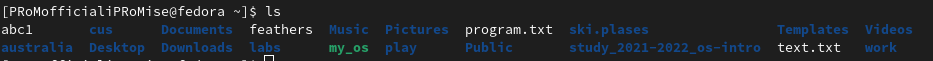{ #fig:001 width=70% }

##

Перейдите в каталог /tmp. У меня его не было в домашней папке, поэтому пришлось создавать его заново.
Выведите на экран содержимое каталога /tmp.Для этого используйте команду ls с различными опциями (рис. [-@fig:002], [-@fig:003], [-@fig:004])

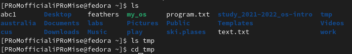{ #fig:002 width=70% }

{ #fig:003 width=70% }

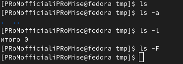{ #fig:004 width=70% }

##

Определите,есть ли в каталоге /var/spool подкаталог с именем cron? (Даже каталога var не было, поэтому я его создал) (рис. [-@fig:005])
	
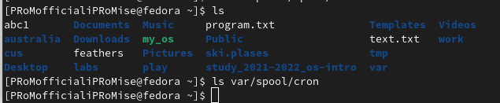{ #fig:005 width=70% }

##

В домашнем каталоге создайте новый каталог с именем newdir. (рис. [-@fig:006])

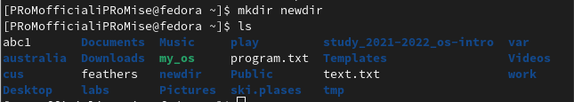{ #fig:006 width=70% }

##

В каталоге ~/newdir создайте новый каталог с именем morefun. (рис. [-@fig:007])

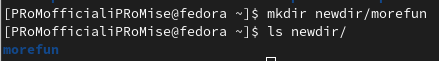{ #fig:007 width=70% }

##

В домашнем каталоге создайте одной командой три новых каталога с именами letters,memos,misk.Затем удалите эти каталоги одной командой. (рис. [-@fig:008], [-@fig:009])

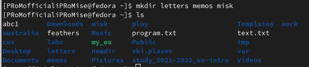{ #fig:008 width=70% }
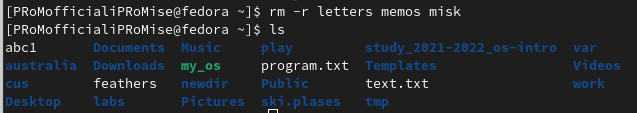{ #fig:009 width=70% }

##

Попробуйте удалить ранее созданный каталог ~/newdir командой rm.Проверьте, был ли каталог удалён. (рис. [-@fig:010])

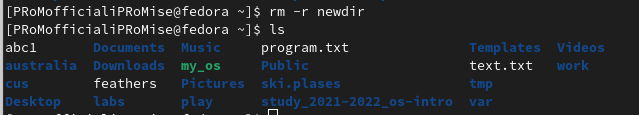{ #fig:010 width=70% }

##

Удалите каталог ~/newdir/morefun из домашнего каталога. Проверьте,был ли каталог удалён. (рис. [-@fig:011])

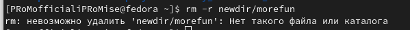{ #fig:009 width=70% }

##

Вызов мануалов к командам (рис. [-@fig:013], [-@fig:014] , [-@fig:015, [-@fig:016], [-@fig:017], [-@fig:018], [-@fig:019])

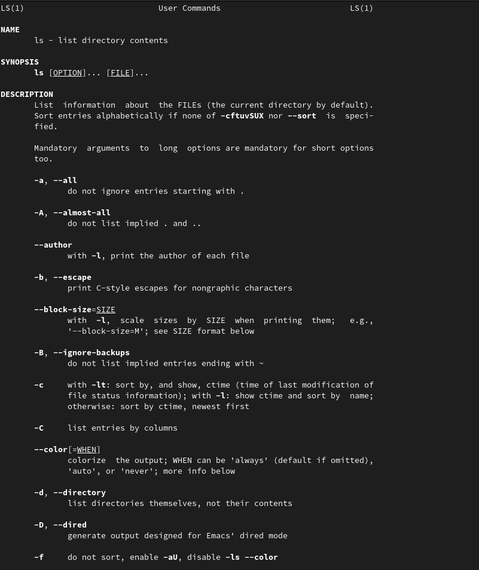{ #fig:009 width=70% }

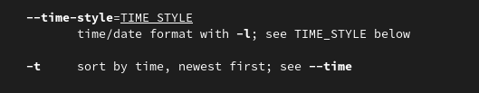{ #fig:009 width=70% }

##

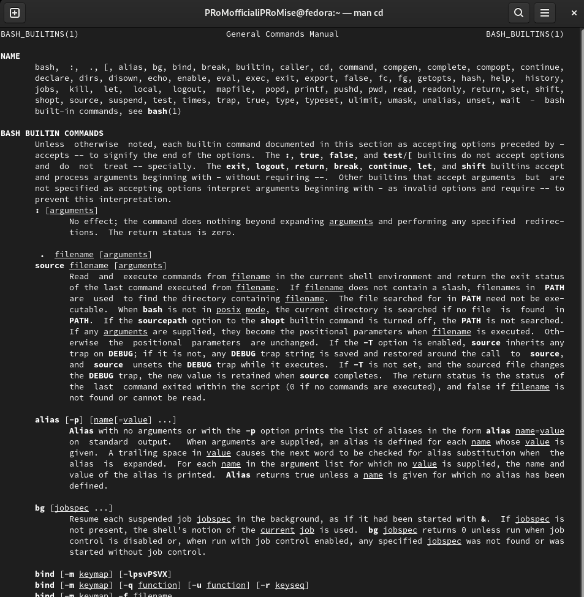{ #fig:009 width=70% }

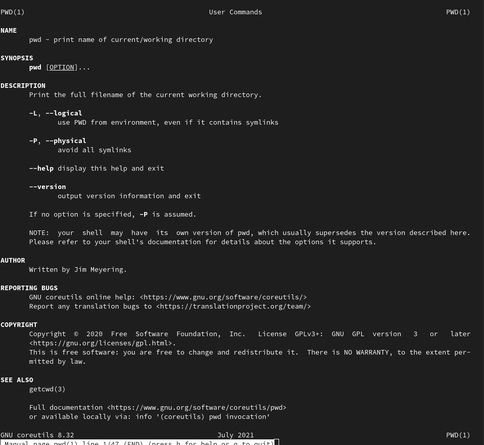{ #fig:009 width=70% }

##

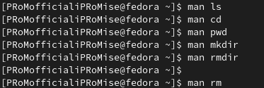{ #fig:009 width=70% }

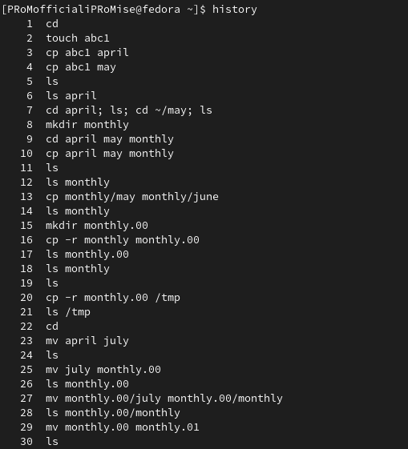{ #fig:009 width=70% }

##

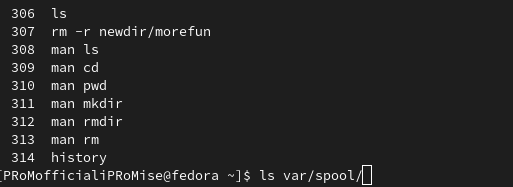{ #fig:009 width=70% }

## Выводы

Я приобрел практические навыки взаимодействия пользователя с системой посредством командной строки.
