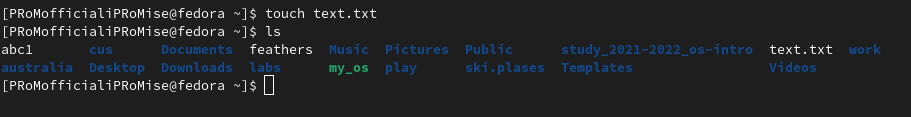
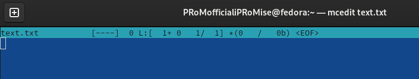
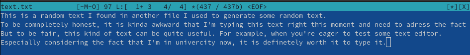
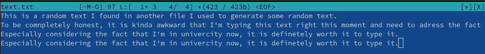
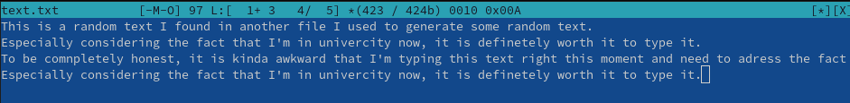
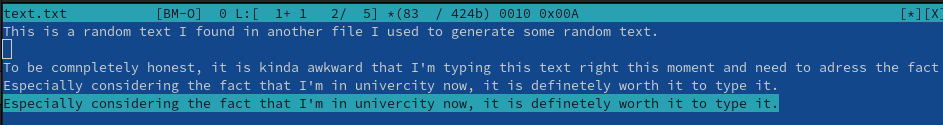
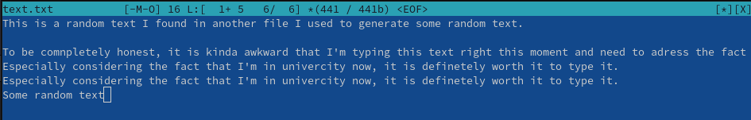
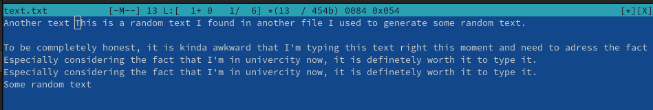
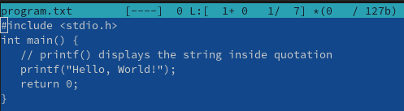
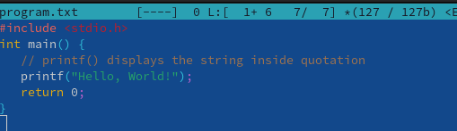

---
## Front matter
lang: ru-RU
title: Командная оболочка Midnight Commander
author: |
	  Кузнецов Алексей НБИбд-02-21\inst{1}

institute: |
	\inst{1}Российский Университет Дружбы Народов

date: 14 Мая, 2022, Москва, Россия

## Formatting
mainfont: PT Serif
romanfont: PT Serif
sansfont: PT Sans
monofont: PT Mono
toc: false
slide_level: 2
theme: metropolis
header-includes: 
 - \metroset{progressbar=frametitle,sectionpage=progressbar,numbering=fraction}
 - '\makeatletter'
 - '\beamer@ignorenonframefalse'
 - '\makeatother'
aspectratio: 43
section-titles: true

---

## Цель работы

Освоение основных возможностей командной оболочки Midnight Commander.Приобретение навыков практической работы по просмотру каталогов и файлов; 
манипуляций с ними.

##
# Задание по встроенному редактору mc
Создал текстовый файл text.txt(рис. [-@fig:013])

{ #fig:013 width=70% }

##

 Открыл этот файл с помощью встроенного в mc редактора

##

Вставил в открытый файл небольшой текст, скопированный из Интернета.(рис. [-@fig:014])

{ #fig:014 width=70% }

##

Проделал с текстом следующие манипуляции, используя горячие клавиши:(рис. [-@fig:015])
Удалил строку.
Выделил фрагмент текста и скопировал его на новую строку.
Выделил фрагмент текста и перенес его на новую строку.

{ #fig:015 width=70% }

##

##

Сохранил файл.

Отменил последнее действие

Перешел в конец файла(нажав комбинацию клавиш) и написал некоторый текст.

 Перешел в начало файла(нажав комбинацию клавиш) и написал некоторый текст.

Сохранил и закрыл файл

##

##

##

##

##

Открыл файл с исходным текстом в терминале.(рис. [-@fig:017])

{ #fig:017 width=70% }

##

Используя меню редактора, выключил подсветку синтаксиса(рис. [-@fig:018])

{ #fig:018 width=70% }

## Вывод

Освоил основные возможности командной оболочки Midnight Commander, приобрел навыки практической работы по просмотру каталогов и файлов; манипуляций с ними.

