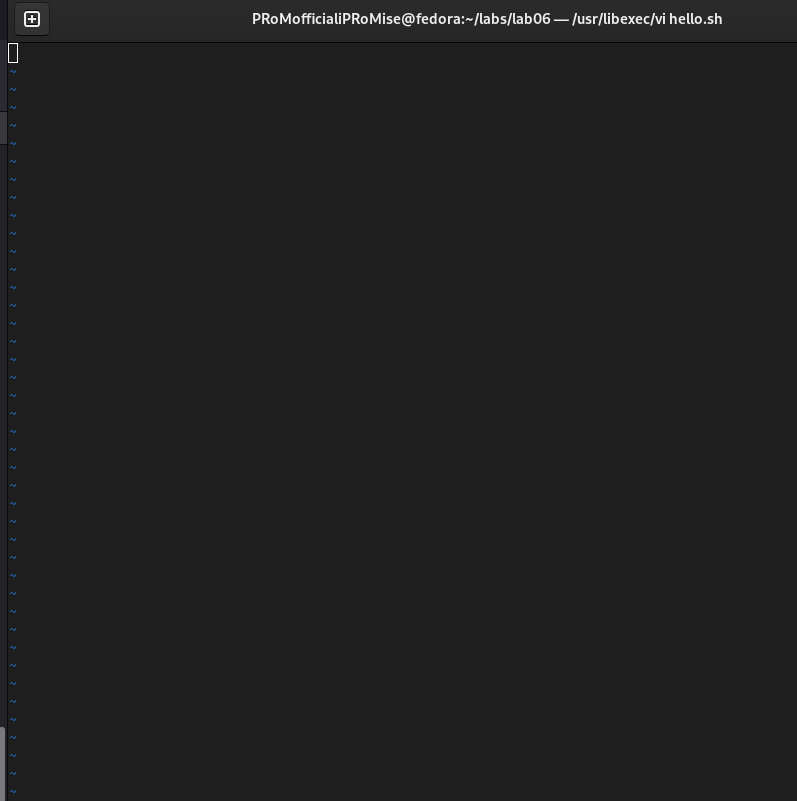
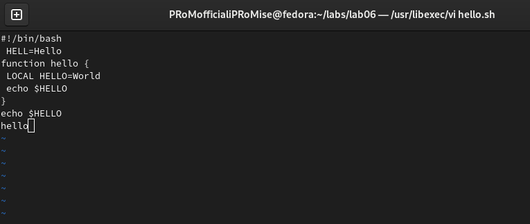
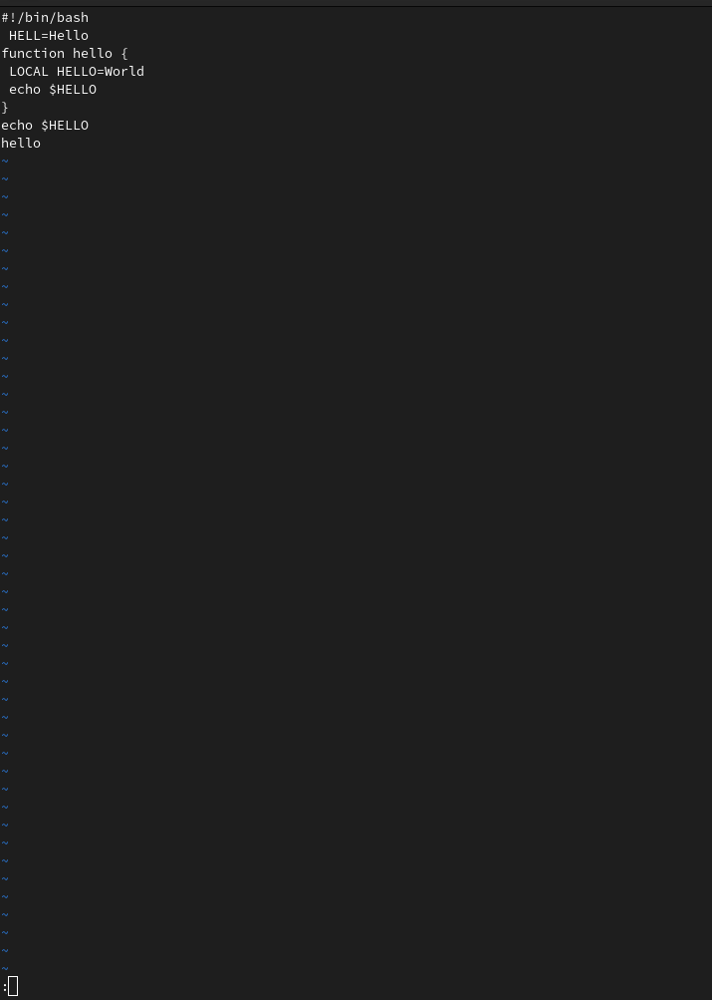
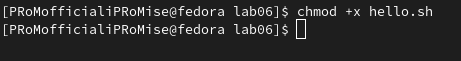
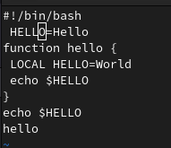
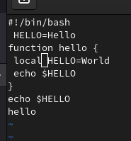
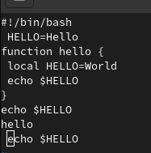
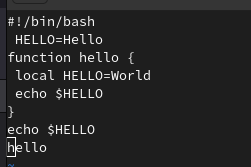
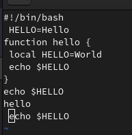

---
## Front matter
lang: ru-RU
title: Текстовой редактор vi
author: |
	  Кузнецов Алексей НБИбд-02-21\inst{1}

institute: |
	\inst{1}Российский Университет Дружбы Народов

date: 14 мая, 2022, Москва, Россия

## Formatting
mainfont: PT Serif
romanfont: PT Serif
sansfont: PT Sans
monofont: PT Mono
toc: false
slide_level: 2
theme: metropolis
header-includes: 
 - \metroset{progressbar=frametitle,sectionpage=progressbar,numbering=fraction}
 - '\makeatletter'
 - '\beamer@ignorenonframefalse'
 - '\makeatother'
aspectratio: 43
section-titles: true

---

# Цель работы

Познакомиться с операционной системой Linux.Получить практические навыки работы с редактором vi,установленным по умолчанию практически во всех дистрибутивах

## Выполнение лабораторной работы
# Задание 1. Создание нового файла с использованием vi

Создаю каталог с именем ~/work/os/lab06
Перехожу во вновь созданный каталог.
Вызвал vi и создаю файл hello.sh

##

##

Нажимаю клавишу i и ввожу следующий текст:

1 #!/bin/bash

2 HELL=Hello

3 function hello {

4 LOCAL HELLO=World

5 echo $HELLO

6 }

7 echo $HELLO

8 hello

##

##

Далее нажимаю клавишу Esc для перехода в командный режим после завершения ввода текста.
Также нажимаю ":" для перехода в режим последней строки и внизу экрана появилось приглашение в виде двоеточия.

##

Нажимаю w(записать) и q(выйти), а затем нажал клавишу Enter для сохранения текста и завершения работы.

##

Сделал файл исполняемым.

 

##
# Задание 2. Редактирование существующего файла

Вызываю vi на редактирование файла.

##

Установил курсор в конец слова HELL второй строки.

##

Далее перехожу в режим вставки и заменил его на HELLO,  нажал Esc для возврата в командый режим.

##

Установлю курсор на четвертую строку и сотру слова LOCAL.

##

Перешел в режим вставки и набрал следующий текст: local, нажал Esc для возврата в командный режим.

 
##

Установил курсор на последней строке файла. Вставил после неё строку, содержащую следующий текст: echo $HELLO.

##

Нажал Esc для перехода в командный режим.
Удалил последнюю строку.

##

Ввел команду отмены изменений u для отмены последней команды

##

Ввел символ «:» для перехода в режим последней строки. Записал произведённые изменения и вышел из vi.

## Вывод

Я познакомился с операционной системой Linux, получил практические навыки работы с редактором vi, установленным по умолчанию практически во всех дистрибутивах.

