---
## Front matter
lang: ru-RU
title: Structural approach to the deep learning method
author: |
	Кузнецов Алексей Владимирович\inst{1}
institute: |
	\inst{1}RUDN University, Moscow, Russian Federation
date: 13 Июня, 2022, Москва, Россия

## Formatting
toc: false
slide_level: 2
theme: metropolis
header-includes: 
 - \metroset{progressbar=frametitle,sectionpage=progressbar,numbering=fraction}
 - '\makeatletter'
 - '\beamer@ignorenonframefalse'
 - '\makeatother'
aspectratio: 43
section-titles: true
---

## Цель работы

Познакомиться с операционной системой Linux. Получить практические навыки работы с редактором Emacs.

## Задание

1. Открыть emacs.
2. Создать файл lab07.sh с помощью комбинации Ctrl-x Ctrl-f ( C-x C-f ).
3. Наберите текст.
4. Сохранить файл с помощью комбинации Ctrl-x Ctrl-s ( C-x C-s ).
5. Проделать с текстом стандартные процедуры редактирования, каждое действие должно осуществляться комбинацией клавиш.
   1. Вырезать одной командой целую строку ( С-k ).
   2. Вставить эту строку в конец файла ( C-y ).
   3. Выделить область текста ( C-space ).
   4. Скопировать область в буфер обмена ( M-w ).
   5. Вставить область в конец файла.
   6. Вновь выделить эту область и на этот раз вырезать её ( C-w ).
   7. Отмените последнее действие ( C-/ ).
6. Научитесь использовать команды по перемещению курсора.
   1. Переместите курсор в начало строки ( C-a ).
   2. Переместите курсор в конец строки ( C-e ).
   3. Переместите курсор в начало буфера ( M-< ).
   4. Переместите курсор в конец буфера ( M-> ).
7. Управление буферами.
   1. Вывести список активных буферов на экран ( C-x C-b ).
   2. Переместитесь во вновь открытое окно ( C-x ) o со списком открытых буферов и переключитесь на другой буфер.
   3. Закройте это окно ( C-x 0 ).
   4. Теперь вновь переключайтесь между буферами, но уже без вывода их списка на экран ( C-x b ).
8. Управление окнами.
   1. Поделите фрейм на 4 части: разделите фрейм на два окна по вертикали ( C-x 3 ), а затем каждое из этих окон на две части по горизонтали ( C-x 2 ).
   2. В каждом из четырёх созданных окон откройте новый буфер (файл) и введите несколько строк текста.
9. Режим поиска
   1. Переключитесь в режим поиска ( C-s ) и найдите несколько слов, присутствующих в тексте.
   2. Переключайтесь между результатами поиска, нажимая C-s .
   3. Выйдите из режима поиска, нажав C-g .
   4. Перейдите в режим поиска и замены ( M-% ), введите текст, который следует найти и заменить, нажмите Enter , затем введите текст для замены. После того как будут подсвечены результаты поиска, нажмите ! для подтверждения замены.
   5. Испробуйте другой режим поиска, нажав M-s o . Объясните, чем он отличается от обычного режима?

## Выполнение лабораторной работы

Откроем редактор Emacs с помощью команды «emacs &» (рис. -@fig:002).

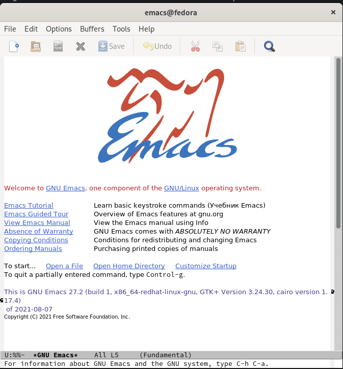{ #fig:002 }

##

Создадим файл lab10.sh с помощью комбинации «Ctrl-x» «Ctrl-f».

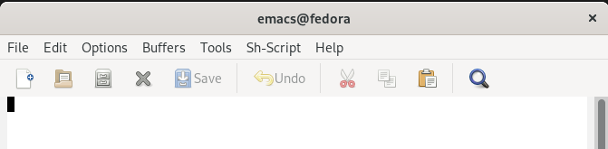{ #fig:002 }

##

В открывшемся буфере наберем необходимый текст (рис. -@fig:003).

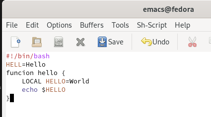{ #fig:003 }

##

Сохраним файл с помощью комбинации «Ctrl-x» «Ctrl-s» (рис. -@fig:004).

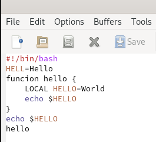{ #fig:004 }

##

Вырежем одной командой целую строку («Сtrl-k») (рис. -@fig:005).

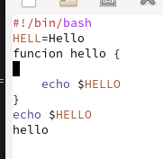{ #fig:005 }

##

Вставим эту строку в конец файла («Ctrl-y») (рис. -@fig:006).

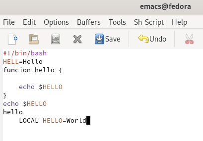{ #fig:006 }

##

Выделим область текста («Ctrl-space»).
Скопируем область в буфер обмена («Alt-w»).
Вставим область в конец файла («Ctrl-y») (рис. -@fig:007).

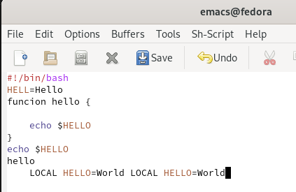{ #fig:007 }

##

Вновь выделим эту область («Ctrl-space») и на этот раз вырежем её («Ctrl-w») (рис. -@fig:008).

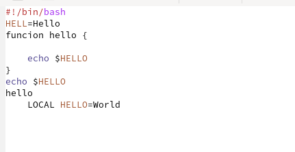{ #fig:008 }

##

Отменим последнее действие («Ctrl-/») (рис. -@fig:009).

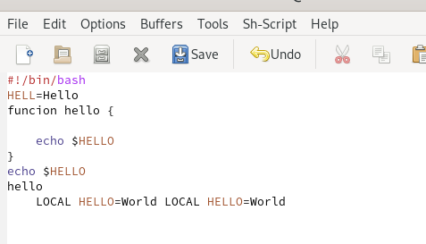{ #fig:009 }

##

Переместим курсор в начало строки («Ctrl-a») (рис. -@fig:010).

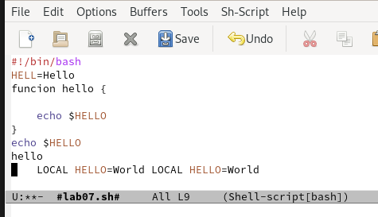{ #fig:010 }

##

Переместим курсор в конец строки («Ctrl-e») (рис. -@fig:011).

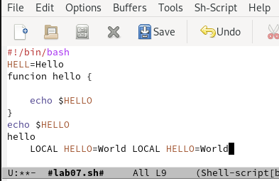{ #fig:011 }

##

Выведем список активных буферов на экран («Ctrl-x» «Ctrl-b») (рис. -@fig:012).

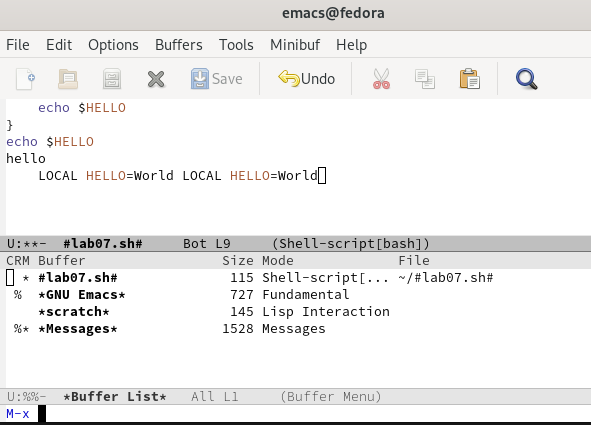{ #fig:012 }

# Выводы

В ходе выполнения данной лабораторной работы я познакомился с операционной системой Linux и получил практические навыки работы с редактором Emacs.
