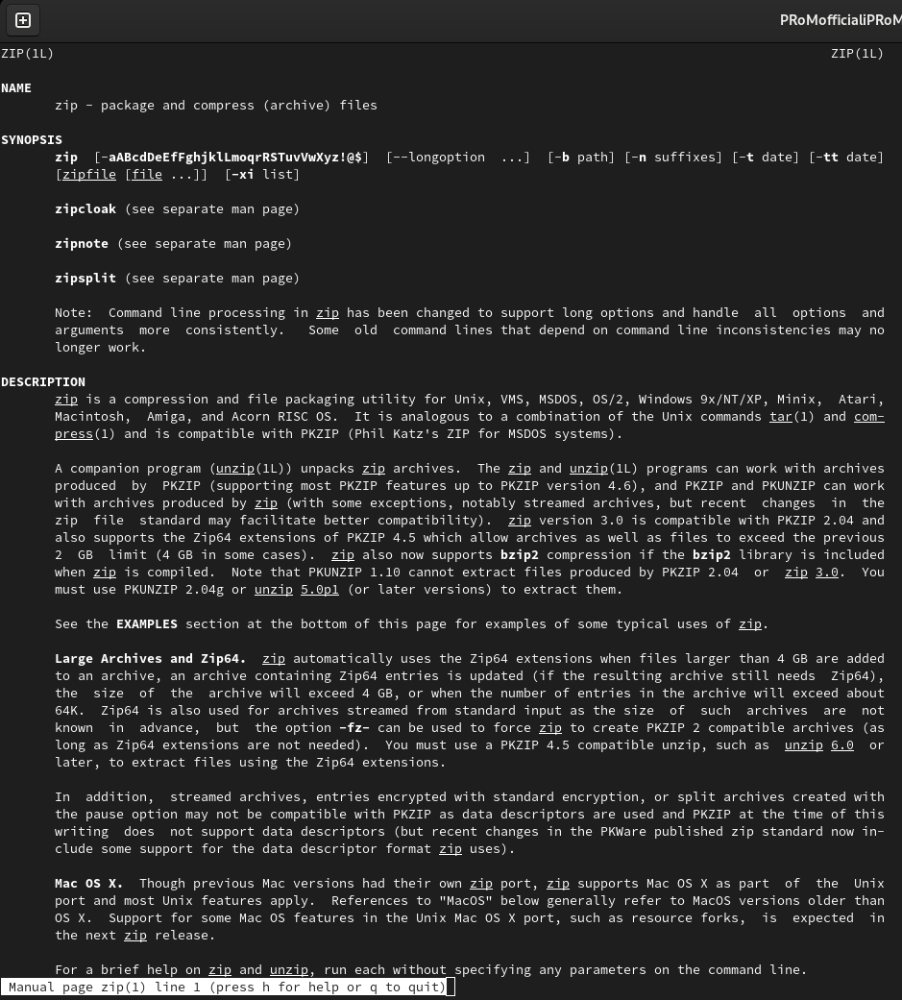
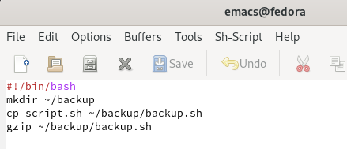
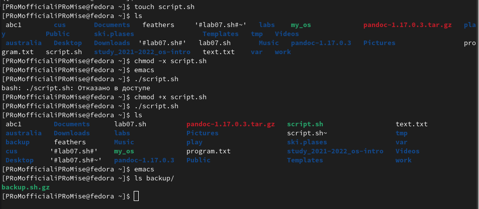
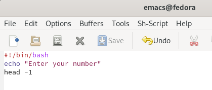
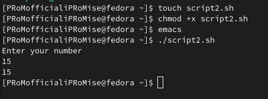
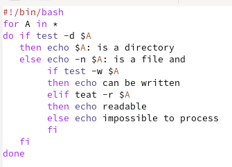
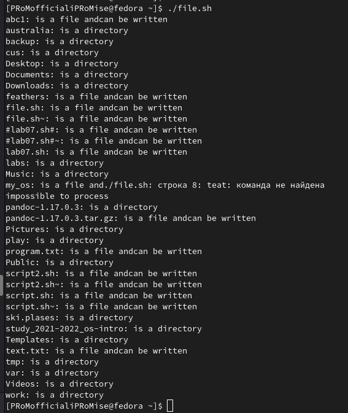
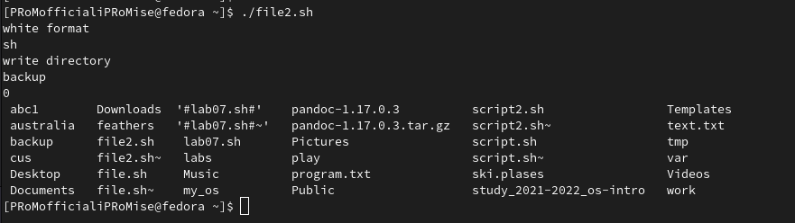
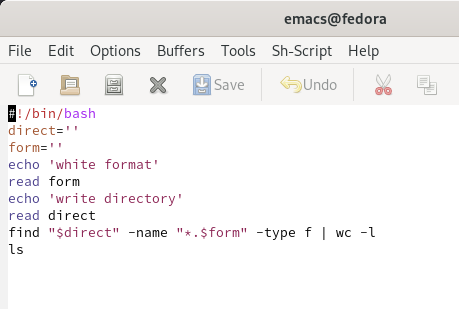

---
## Front matter
lang: ru-RU
title: Программирование в командном процессоре ОС Linux
author: |
	Кузнецов Алкексей Владимирович НБИбд-02-21\inst{1}
institute: |
	\inst{1}RUDN University, Moscow, Russian Federation
date: 13 Июня, 2022, Москва, Россия

## Formatting
toc: false
slide_level: 2
theme: metropolis
header-includes: 
 - \metroset{progressbar=frametitle,sectionpage=progressbar,numbering=fraction}
 - '\makeatletter'
 - '\beamer@ignorenonframefalse'
 - '\makeatother'
aspectratio: 43
section-titles: true
---

## Цель работы: 

Изучить основы программирования в оболочке ОС UNIX/Linux, научиться писать небольшие командные файлы.

## Ход работы:

1. Написал скрипт, который при запуске будет делать резервную копию самого себя (то есть файла, в котором содержится его исходный код) в другую директорию backup в домашнем каталоге. При этом файл должен архивироваться одним из архиваторов на выбор zip, bzip2 или tar. Способ использования команд архивации узнал, изучив справку.(рис. 1 [-@fig:001], [-@fig:002], [-@fig:003] )

{ #fig:001 width=70% }

{ #fig:002 width=70% }

{ #fig:003 width=70% }

##

2. Написал пример командного файла, обрабатывающего любое произвольное
число аргументов командной строки, в том числе превышающее десять. Например, скрипт может последовательно распечатывать значения всех переданных
аргументов.(рис. [-@fig:004])(рис. [-@fig:005])

{ #fig:004 width=70% }

{ #fig:005 width=70% }

##

3. Написал командный файл — аналог команды ls (без использования самой этой
команды и команды dir). Требуется, чтобы он выдавал информацию о нужном
каталоге и выводил информацию о возможностях доступа к файлам этого каталога.(рис. [-@fig:006])(рис. [-@fig:007])

{ #fig:006 width=70% }

{ #fig:007 width=70% }

##

4. Написал командный файл, который получает в качестве аргумента командной
строки формат файла (.txt, .doc, .jpg, .pdf и т.д.) и вычисляет количество
таких файлов в указанной директории. Путь к директории также передаётся в
виде аргумента командной строки.(рис. [-@fig:009])(рис. [-@fig:010])

{ #fig:009 width=70% }

{ #fig:009 width=70% }

## Вывод:

Изучил основы программирования в оболочке ОС UNIX/Linux, научился писать небольшие командные файлы.
